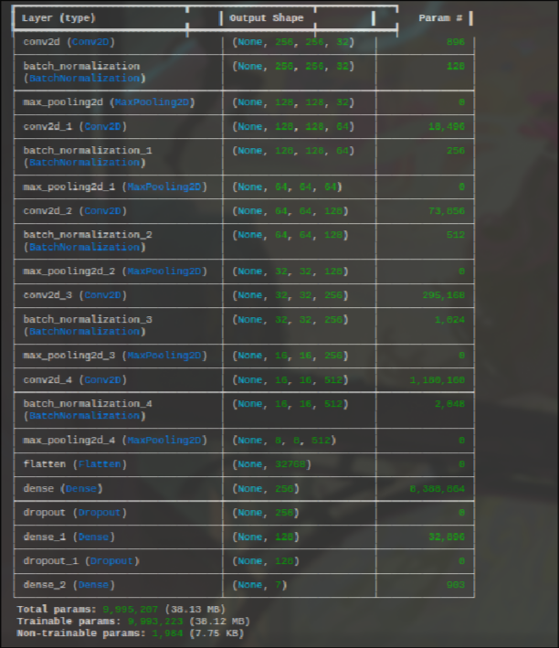

# Facial Expression Detection 😊😠😢😮

This project implements a facial expression detection model using a CNN architecture in TensorFlow/Keras. The model is trained on the Kaggle [Facial Expression Recognition Dataset](https://www.kaggle.com/datasets/jonathanoheix/face-expression-recognition-dataset).



## 📁 Project Structure
├── model.ipynb # Jupyter notebook with the full training pipeline
├── screenshot.png # Model Summary
└── README.md # Project documentation


## 🚀 How to Run

1. Place your `kaggle.json` API key in the root directory.
2. Install the required packages:
   ```bash
   pip install tensorflow  kaggle

3 Run the Notebook:
```bash
jupyter notebook model.ipynb
